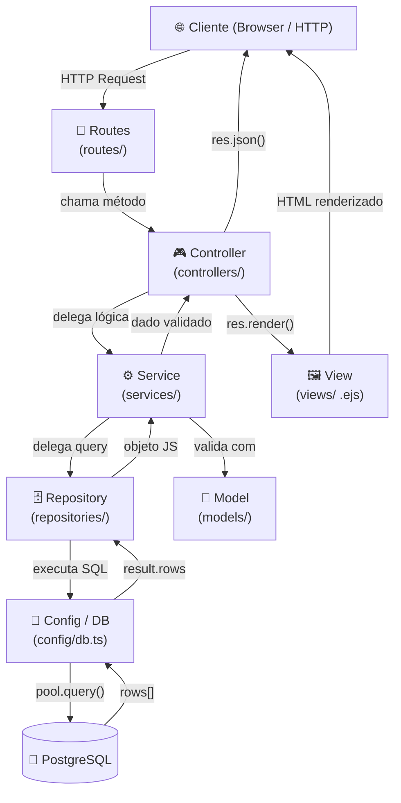
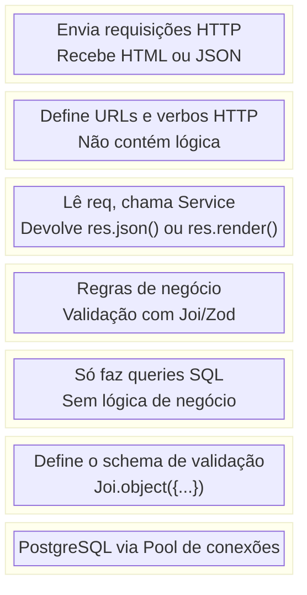
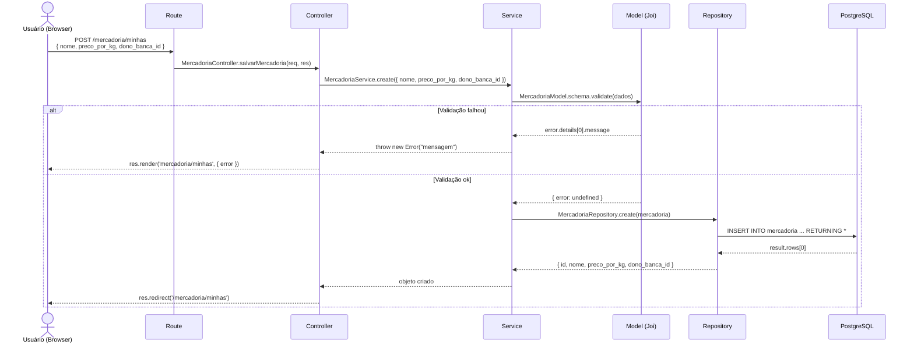
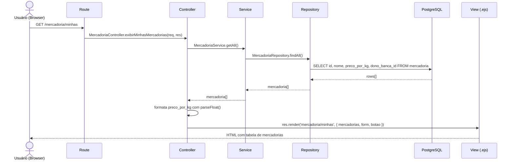
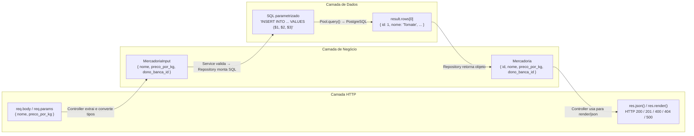
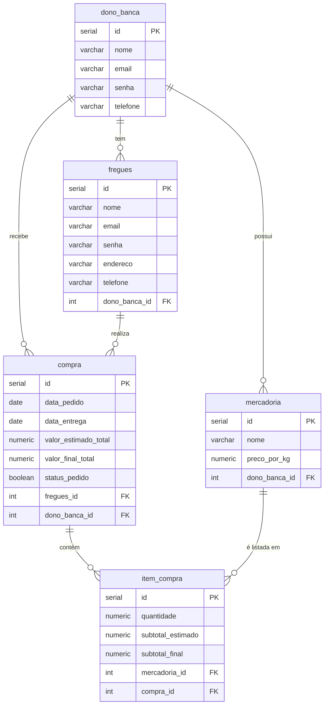
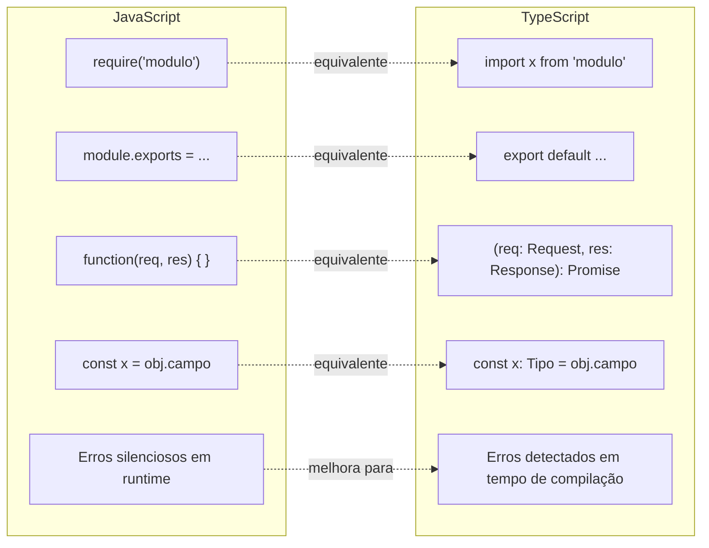
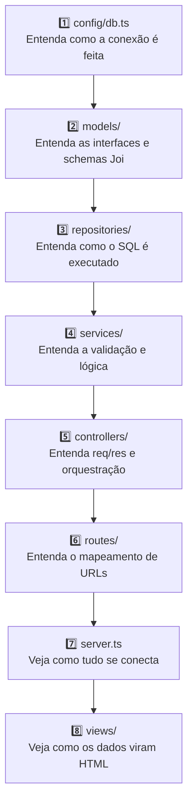

# Arquitetura em Camadas — Guia para Estudantes

> **Contexto:** Este guia é baseado em um projeto real feito em **JavaScript** (Node.js + Express + PostgreSQL).

>Caso queiram dar uma olhadinha: https://github.com/MariaEduarda-lab/projeto_individual.git

Dica: baixe o repositório, rode em localhost e explore o código para entender melhor cada camada. Depois, use este guia para comparar com a versão em **TypeScript** que vocês vão criar ou estudar.

> Os exemplos de código são apresentados em **TypeScript**, adaptando os mesmos padrões do projeto original.

---

## 1. Visão Geral da Arquitetura

O projeto segue o padrão **MVC estendido**, dividido em seis camadas principais. Cada camada tem uma responsabilidade única e só se comunica com a camada imediatamente adjacente.



---

## 2. O que cada camada faz



| Camada | Pasta | Responsabilidade | Responde à pergunta |
|---|---|---|---|
| **Routes** | `routes/` | Mapear URL + verbo HTTP para um controller | *"Qual URL chama qual função?"* |
| **Controller** | `controllers/` | Receber `req`/`res`, orquestrar a resposta | *"O que fazer com essa requisição?"* |
| **Service** | `services/` | Aplicar regras de negócio e validações | *"Os dados são válidos? Qual a lógica?"* |
| **Repository** | `repositories/` | Executar queries no banco de dados | *"Como ler/escrever no banco?"* |
| **Model** | `models/` | Definir o formato/schema dos dados | *"Quais campos são obrigatórios?"* |
| **Config/DB** | `config/` | Gerenciar a conexão com o banco | *"Como me conectar ao PostgreSQL?"* |
| **View** | `views/` | Renderizar HTML com dados dinâmicos | *"Como exibir isso para o usuário?"* |

---

## 3. Fluxo completo de uma requisição

### Exemplo: Cadastrar uma nova Mercadoria



---

### Exemplo: Listar Mercadorias (GET com render de View)



---

## 4. Detalhamento de cada camada em TypeScript

### 4.1 `config/db.ts` — Conexão com o Banco

Esta é a **base de tudo**. Cria um *pool* de conexões reutilizáveis com o PostgreSQL. Sem isso, nenhuma outra camada funciona.

**JavaScript (projeto original):**
```javascript
// config/db.js
const { Pool } = require('pg');
require('dotenv').config();

const pool = new Pool({
  user: process.env.DB_USER,
  host: process.env.DB_HOST,
  database: process.env.DB_DATABASE,
  password: process.env.DB_PASSWORD,
  port: process.env.DB_PORT,
  ssl: isSSL ? { rejectUnauthorized: false } : false,
});

module.exports = {
  query: (text, params) => pool.query(text, params),
  connect: () => pool.connect(),
};
```

**TypeScript (equivalente):**
```typescript
// config/db.ts
import { Pool, QueryResult } from 'pg';
import dotenv from 'dotenv';
dotenv.config();

const isSSL = process.env.DB_SSL === 'true';

const pool = new Pool({
  user: process.env.DB_USER,
  host: process.env.DB_HOST,
  database: process.env.DB_DATABASE,
  password: process.env.DB_PASSWORD,
  port: Number(process.env.DB_PORT),
  ssl: isSSL ? { rejectUnauthorized: false } : false,
});

export default {
  query: (text: string, params?: unknown[]): Promise<QueryResult> =>
    pool.query(text, params),
  connect: () => pool.connect(),
};
```

> **O que muda no TypeScript:** `require` vira `import`, as funções ganham tipos explícitos (`string`, `unknown[]`, `Promise<QueryResult>`), e `port` precisa de `Number()` pois `process.env` sempre retorna `string | undefined`.

---

### 4.2 `models/` — Schema de Validação

O Model **não representa uma tabela diretamente** — ele define as **regras de validação** dos dados usando a biblioteca Joi.

**JavaScript (projeto original):**
```javascript
// models/mercadoriaModel.js
const Joi = require('joi');

class MercadoriaModel {
    static get schema() {
        return Joi.object({
            nome: Joi.string().max(100).required(),
            preco_por_kg: Joi.number().precision(2).positive().required(),
            dono_banca_id: Joi.number().integer().required()
        });
    }
}

module.exports = MercadoriaModel;
```

**TypeScript (equivalente):**
```typescript
// models/mercadoriaModel.ts
import Joi from 'joi';

// Interface descreve o "formato" do objeto
export interface MercadoriaInput {
  nome: string;
  preco_por_kg: number;
  dono_banca_id: number;
}

// Interface para objeto retornado do banco (inclui o id)
export interface Mercadoria extends MercadoriaInput {
  id: number;
}

class MercadoriaModel {
  static get schema(): Joi.ObjectSchema<MercadoriaInput> {
    return Joi.object({
      nome: Joi.string().max(100).required(),
      preco_por_kg: Joi.number().precision(2).positive().required(),
      dono_banca_id: Joi.number().integer().required(),
    });
  }
}

export default MercadoriaModel;
```

> **O que muda no TypeScript:** Adicionamos `interfaces` que descrevem o formato dos dados. O TypeScript garante em tempo de compilação que ninguém passe um campo errado. `MercadoriaInput` é o que entra, `Mercadoria` é o que sai do banco (tem `id`).

---

### 4.3 `repositories/` — Acesso ao Banco de Dados

O Repository é a **única camada que fala SQL**. Ele recebe objetos JavaScript e devolve objetos JavaScript — nunca retorna `res` ou lida com requisições HTTP.

**JavaScript (projeto original):**
```javascript
// repositories/mercadoriaRepository.js
const db = require('../config/db');

class MercadoriaRepository {
  async findAll() {
    const result = await db.query(
      'SELECT id, nome, preco_por_kg, dono_banca_id FROM mercadoria'
    );
    return result.rows;
  }

  async create(mercadoria) {
    const { nome, preco_por_kg, dono_banca_id } = mercadoria;
    const result = await db.query(
      'INSERT INTO mercadoria (nome, preco_por_kg, dono_banca_id) VALUES ($1, $2, $3) RETURNING id, nome, preco_por_kg, dono_banca_id',
      [nome, preco_por_kg, dono_banca_id]
    );
    return result.rows[0];
  }
  // ... update, delete, findById
}

module.exports = new MercadoriaRepository();
```

**TypeScript (equivalente):**
```typescript
// repositories/mercadoriaRepository.ts
import db from '../config/db';
import { Mercadoria, MercadoriaInput } from '../models/mercadoriaModel';

class MercadoriaRepository {
  async findAll(): Promise<Mercadoria[]> {
    const result = await db.query(
      'SELECT id, nome, preco_por_kg, dono_banca_id FROM mercadoria'
    );
    return result.rows as Mercadoria[];
  }

  async findById(id: number): Promise<Mercadoria | null> {
    const result = await db.query(
      'SELECT id, nome, preco_por_kg, dono_banca_id FROM mercadoria WHERE id = $1',
      [id]
    );
    if (result.rows.length === 0) return null;
    return result.rows[0] as Mercadoria;
  }

  async create(mercadoria: MercadoriaInput): Promise<Mercadoria> {
    const { nome, preco_por_kg, dono_banca_id } = mercadoria;
    const result = await db.query(
      'INSERT INTO mercadoria (nome, preco_por_kg, dono_banca_id) VALUES ($1, $2, $3) RETURNING id, nome, preco_por_kg, dono_banca_id',
      [nome, preco_por_kg, dono_banca_id]
    );
    return result.rows[0] as Mercadoria;
  }

  async update(id: number, mercadoria: MercadoriaInput): Promise<Mercadoria> {
    const { nome, preco_por_kg, dono_banca_id } = mercadoria;
    const result = await db.query(
      'UPDATE mercadoria SET nome = $1, preco_por_kg = $2, dono_banca_id = $3 WHERE id = $4 RETURNING id, nome, preco_por_kg, dono_banca_id',
      [nome, preco_por_kg, dono_banca_id, id]
    );
    return result.rows[0] as Mercadoria;
  }

  async delete(id: number): Promise<void> {
    await db.query('DELETE FROM mercadoria WHERE id = $1', [id]);
  }
}

export default new MercadoriaRepository();
```

> **O que muda no TypeScript:** Cada método declara seu tipo de retorno (`Promise<Mercadoria[]>`, `Promise<Mercadoria | null>` etc.). O `as Mercadoria` é um *type cast* — dizemos ao TypeScript "confie em mim, isso tem esse formato". Os parâmetros também têm tipos explícitos (`id: number`, `mercadoria: MercadoriaInput`).

---

### 4.4 `services/` — Lógica de Negócio

O Service é o **cérebro da aplicação**. Valida os dados usando o Model antes de chamar o Repository. Se a validação falhar, lança um erro — o Controller captura esse erro e decide o que mostrar ao usuário.

**JavaScript (projeto original):**
```javascript
// services/mercadoriaService.js
const MercadoriaRepository = require('../repositories/mercadoriaRepository');
const MercadoriaModel = require('../models/mercadoriaModel');

class MercadoriaService {
  async create(mercadoria) {
    const { error } = MercadoriaModel.schema.validate(mercadoria);
    if (error) throw new Error(error.details[0].message);

    return await MercadoriaRepository.create(mercadoria);
  }

  async update(id, mercadoria) {
    const { error } = MercadoriaModel.schema.validate(mercadoria);
    if (error) throw new Error(error.details[0].message);

    return await MercadoriaRepository.update(id, mercadoria);
  }
  // ... getAll, getById, delete
}

module.exports = new MercadoriaService();
```

**TypeScript (equivalente):**
```typescript
// services/mercadoriaService.ts
import MercadoriaRepository from '../repositories/mercadoriaRepository';
import MercadoriaModel, { Mercadoria, MercadoriaInput } from '../models/mercadoriaModel';

class MercadoriaService {
  async getAll(): Promise<Mercadoria[]> {
    return MercadoriaRepository.findAll();
  }

  async getById(id: number): Promise<Mercadoria | null> {
    return MercadoriaRepository.findById(id);
  }

  async create(mercadoria: MercadoriaInput): Promise<Mercadoria> {
    const { error } = MercadoriaModel.schema.validate(mercadoria);
    if (error) throw new Error(error.details[0].message);

    return MercadoriaRepository.create(mercadoria);
  }

  async update(id: number, mercadoria: MercadoriaInput): Promise<Mercadoria> {
    const { error } = MercadoriaModel.schema.validate(mercadoria);
    if (error) throw new Error(error.details[0].message);

    return MercadoriaRepository.update(id, mercadoria);
  }

  async delete(id: number): Promise<void> {
    return MercadoriaRepository.delete(id);
  }
}

export default new MercadoriaService();
```

> **Padrão importante:** O Service **nunca** conhece `req` ou `res`. Ele trabalha apenas com dados puros (objetos, números, strings). Se algo der errado, ele lança um `Error` — quem decide o que fazer com esse erro é o Controller.

---

### 4.5 `controllers/` — Orquestração da Resposta HTTP

O Controller é a **porta de entrada** para cada requisição. Ele conhece `req` e `res`, chama o Service com os dados extraídos do `req`, e decide se vai renderizar uma View ou retornar JSON.

**JavaScript (projeto original):**
```javascript
// controllers/mercadoriaController.js (método salvarMercadoria)
async salvarMercadoria(req, res) {
    try {
        const { id, nome, preco_por_kg, dono_banca_id } = req.body;

        let resultado;
        if (id) {
            resultado = await MercadoriaService.update(id, { nome, preco_por_kg, dono_banca_id });
        } else {
            resultado = await MercadoriaService.create({ nome, preco_por_kg, dono_banca_id });
        }

        res.redirect('/mercadoria/minhas');
    } catch (error) {
        res.render('mercadoria/minhas', {
            mercadorias: await MercadoriaService.getAll(),
            form: req.body,
            botao: req.body.id ? "Atualizar" : "Cadastrar",
            error: error.message
        });
    }
}
```

**TypeScript (equivalente):**
```typescript
// controllers/mercadoriaController.ts
import { Request, Response } from 'express';
import MercadoriaService from '../services/mercadoriaService';

const MercadoriaController = {
  async index(req: Request, res: Response): Promise<void> {
    try {
      const mercadorias = await MercadoriaService.getAll();
      res.status(200).json(mercadorias);
    } catch (error) {
      res.status(500).json({ error: 'Erro ao listar mercadorias' });
    }
  },

  async salvarMercadoria(req: Request, res: Response): Promise<void> {
    try {
      const { id, nome, preco_por_kg, dono_banca_id } = req.body as {
        id?: string;
        nome: string;
        preco_por_kg: string;
        dono_banca_id: string;
      };

      if (id) {
        await MercadoriaService.update(Number(id), {
          nome,
          preco_por_kg: Number(preco_por_kg),
          dono_banca_id: Number(dono_banca_id),
        });
      } else {
        await MercadoriaService.create({
          nome,
          preco_por_kg: Number(preco_por_kg),
          dono_banca_id: Number(dono_banca_id),
        });
      }

      res.redirect('/mercadoria/minhas');
    } catch (error) {
      const mercadorias = await MercadoriaService.getAll();
      res.render('mercadoria/minhas', {
        mercadorias,
        form: req.body,
        botao: req.body.id ? 'Atualizar' : 'Cadastrar',
        error: error instanceof Error ? error.message : 'Erro desconhecido',
      });
    }
  },
};

export default MercadoriaController;
```

> **Atenção ao `req.body`:** Dados vindos de formulários HTML chegam **sempre como strings**, mesmo que o campo seja `type="number"`. Por isso usamos `Number(preco_por_kg)` para converter. No TypeScript precisamos tipar `req.body` explicitamente, pois ele é `any` por padrão.

---

### 4.6 `routes/` — Mapeamento de URLs

A Route é o **catálogo de endereços** da aplicação. Ela apenas diz "quando chegar uma requisição nesta URL com este verbo HTTP, chame este método do Controller".

**JavaScript (projeto original):**
```javascript
// routes/mercadoriaRoute.js
const express = require('express');
const router = express.Router();
const MercadoriaController = require('../controllers/mercadoriaController');

router.get('/minhas', MercadoriaController.exibirMinhasMercadorias);
router.post('/minhas', MercadoriaController.salvarMercadoria);

router.get('/', MercadoriaController.index);
router.get('/:id', MercadoriaController.show);
router.post('/', MercadoriaController.store);
router.put('/:id', MercadoriaController.update);
router.delete('/:id', MercadoriaController.delete);

module.exports = router;
```

**TypeScript (equivalente):**
```typescript
// routes/mercadoriaRoute.ts
import { Router } from 'express';
import MercadoriaController from '../controllers/mercadoriaController';

const router = Router();

router.get('/minhas', MercadoriaController.exibirMinhasMercadorias);
router.post('/minhas', MercadoriaController.salvarMercadoria);

router.get('/', MercadoriaController.index);
router.get('/:id', MercadoriaController.show);
router.post('/', MercadoriaController.store);
router.put('/:id', MercadoriaController.update);
router.delete('/:id', MercadoriaController.delete);

export default router;
```

> **Mapeamento de verbos HTTP para operações CRUD:**

| Verbo HTTP | URL | Controller | Operação |
|---|---|---|---|
| `GET` | `/mercadoria/` | `index` | Listar tudo |
| `GET` | `/mercadoria/:id` | `show` | Buscar por ID |
| `POST` | `/mercadoria/` | `store` | Criar novo |
| `PUT` | `/mercadoria/:id` | `update` | Atualizar |
| `DELETE` | `/mercadoria/:id` | `delete` | Remover |
| `GET` | `/mercadoria/minhas` | `exibirMinhasMercadorias` | Renderizar View |
| `POST` | `/mercadoria/minhas` | `salvarMercadoria` | Criar/Editar via form |

---

### 4.7 `views/` — Templates EJS

A View é a **camada de apresentação**. Recebe dados do Controller e gera HTML dinâmico. No projeto, usa EJS (Embedded JavaScript Templates).

**Exemplo — exibindo lista de mercadorias em EJS:**
```html
<!-- views/mercadoria/minhas.ejs -->
<table>
  <thead>
    <tr>
      <th>Nome</th>
      <th>Preço por kg</th>
      <th>Ações</th>
    </tr>
  </thead>
  <tbody>
    <% mercadorias.forEach(function(mercadoria) { %>
      <tr>
        <td><%= mercadoria.nome %></td>
        <td>R$ <%= mercadoria.preco_por_kg.toFixed(2) %></td>
        <td>
          <a href="/mercadoria/minhas?editar=<%= mercadoria.id %>">Editar</a> |
          <a href="/mercadoria/minhas?excluir=<%= mercadoria.id %>">Excluir</a>
        </td>
      </tr>
    <% }) %>
  </tbody>
</table>
```

| Tag EJS | Significado | Exemplo |
|---|---|---|
| `<% ... %>` | Executa JavaScript (sem exibir) | `<% if (error) { %>` |
| `<%= ... %>` | Exibe o valor (com escape HTML) | `<%= mercadoria.nome %>` |
| `<%- ... %>` | Exibe HTML cru (sem escape) | `<%- include('../partials/sidebar') %>` |

---

## 5. Fluxo de dados entre as camadas



---

## 6. Banco de Dados — Diagrama ER



---

## 7. Dois modos de resposta do Controller

O projeto usa dois padrões de resposta, dependendo do contexto:

```mermaid
flowchart TD
    REQ["Requisição chega ao Controller"]
    CHECK{"Como foi feita a requisição?"}
    AJAX["fetch() / XMLHttpRequest\n(JavaScript no browser)"]
    FORM["Formulário HTML\n<form method='POST'>"]
    JSON_OK["res.status(201).json({ message: 'Sucesso!' })"]
    JSON_ERR["res.status(400).json({ error: '...' })"]
    RENDER["res.render('view', { dados })"]
    REDIRECT["res.redirect('/outra/pagina')"]

    REQ --> CHECK
    CHECK -->|"req.xhr ou Accept: application/json"| AJAX
    CHECK -->|"submit de formulário"| FORM
    AJAX -->|"Sucesso"| JSON_OK
    AJAX -->|"Erro"| JSON_ERR
    FORM -->|"Sucesso"| REDIRECT
    FORM -->|"Erro"| RENDER
```



**No projeto (JavaScript):**
```javascript
// donoBancaController.js — store()
async store(req, res) {
    try {
        const novoDono = await DonoBancaService.create(req.body);

        // Se for fetch/AJAX, responda com JSON
        if (req.xhr || req.headers.accept.indexOf('json') > -1) {
            return res.status(201).json({ message: 'Cadastro realizado com sucesso!' });
        }

        // Se for formulário tradicional, redirecione
        res.redirect('/mercadoria/minhas');
    } catch (error) {
        if (req.xhr || req.headers.accept.indexOf('json') > -1) {
            return res.status(400).json({ error: error.message });
        }
        res.render('donoBanca/cadastro', { error: error.message });
    }
}
```

**TypeScript (equivalente):**
```typescript
// controllers/donoBancaController.ts
async store(req: Request, res: Response): Promise<void> {
    try {
        const novoDono = await DonoBancaService.create(req.body);

        const isAjax =
            req.xhr || (req.headers.accept?.includes('json') ?? false);

        if (isAjax) {
            res.status(201).json({ message: 'Cadastro realizado com sucesso!' });
            return;
        }

        res.redirect('/mercadoria/minhas');
    } catch (error) {
        const mensagem = error instanceof Error ? error.message : 'Erro desconhecido';
        const isAjax = req.xhr || (req.headers.accept?.includes('json') ?? false);

        if (isAjax) {
            res.status(400).json({ error: mensagem });
            return;
        }

        res.render('donoBanca/cadastro', { error: mensagem });
    }
}
```

---

## 8. `server.ts` — O ponto de entrada

O `server.ts` é onde **tudo começa**. Ele configura o Express, aguarda a conexão com o banco e só então registra as rotas.

**JavaScript (projeto original):**
```javascript
// server.js
require('dotenv').config();
const express = require('express');
const app = express();
const db = require('./config/db');

app.use(express.json());
app.use(express.urlencoded({ extended: true }));
app.set('view engine', 'ejs');

db.connect()
  .then(() => {
    const mercadoriaRoute = require('./routes/mercadoriaRoute');
    app.use('/mercadoria', mercadoriaRoute);

    app.listen(3000, () => console.log('Servidor rodando na porta 3000'));
  })
  .catch(err => console.error('Erro ao conectar ao banco:', err));
```

**TypeScript (equivalente):**
```typescript
// server.ts
import 'dotenv/config';
import express from 'express';
import path from 'path';
import db from './config/db';
import mercadoriaRoute from './routes/mercadoriaRoute';
import donoBancaRoute from './routes/donoBancaRoute';

const app = express();

app.use(express.json());
app.use(express.urlencoded({ extended: true }));
app.set('view engine', 'ejs');
app.set('views', path.join(__dirname, 'views'));

db.connect()
  .then(() => {
    console.log('Conectado ao PostgreSQL');

    app.use('/mercadoria', mercadoriaRoute);
    app.use('/dono', donoBancaRoute);

    // Middleware de 404
    app.use((_req, res) => {
      res.status(404).send('Página não encontrada');
    });

    // Middleware de erro global
    app.use((err: Error, _req: express.Request, res: express.Response) => {
      console.error(err.stack);
      res.status(500).send('Erro no servidor');
    });

    const PORT = Number(process.env.PORT) || 3000;
    app.listen(PORT, () => console.log(`Servidor rodando na porta ${PORT}`));
  })
  .catch((err: Error) => {
    console.error('Erro ao conectar ao banco:', err);
    process.exit(1);
  });
```

---

## 9. Resumo das diferenças: JavaScript → TypeScript



| Conceito | JavaScript | TypeScript |
|---|---|---|
| Importar | `const x = require('y')` | `import x from 'y'` |
| Exportar | `module.exports = x` | `export default x` |
| Tipo de parâmetro | implícito (`any`) | explícito (`id: number`) |
| Retorno de função | implícito | `Promise<Mercadoria>` |
| Formato de objeto | sem contrato | `interface Mercadoria { ... }` |
| Erro em runtime | `undefined is not a function` | Detectado antes de rodar |
| `req.body` | `any` | precisa de cast ou tipagem |

---

## 10. Ordem de estudo recomendada



> **Dica:** Sempre que for escrever uma nova funcionalidade, siga essa ordem de **baixo para cima**: comece pelo Model, depois Repository, depois Service, depois Controller, depois Route. Isso garante que cada camada esteja pronta antes de ser usada pela camada acima.

---

*Guia gerado com base no projeto da Banca da Feira — Node.js/Express/PostgreSQL/EJS*