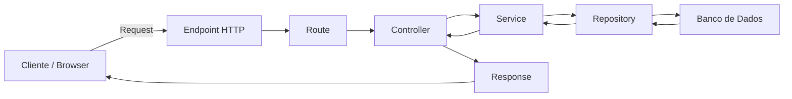

# Fluxo de Requisicao e Endpoints

Este guia explica como uma requisicao percorre uma aplicacao web organizada em camadas e como documentar endpoints de forma clara.

---

## 1. O que e uma requisicao

Uma requisicao acontece quando um cliente, geralmente o navegador ou uma ferramenta como Postman/Insomnia, pede alguma coisa ao servidor.

Exemplos:

- abrir uma pagina;
- cadastrar um usuario;
- listar produtos;
- editar uma mercadoria;
- excluir um registro.

Em uma aplicacao web, essa comunicacao normalmente usa HTTP.

---

## 2. Caminho basico da informacao



Leitura do fluxo:

1. O cliente envia uma requisicao HTTP.
2. A rota identifica qual Controller deve ser chamado.
3. O Controller recebe `req` e `res`.
4. O Service aplica regras de negocio e validacoes.
5. O Repository consulta ou altera o banco.
6. O banco retorna os dados.
7. A resposta volta ate o cliente.

---

## 3. O que e um endpoint

Um endpoint e o ponto de entrada de uma API ou aplicacao web.

Ele combina:

- metodo HTTP;
- caminho da URL;
- dados esperados;
- comportamento esperado;
- status de resposta.

Exemplo:

```http
GET /mercadorias
```

Esse endpoint indica que o cliente quer listar mercadorias.

---

## 4. Metodos HTTP mais usados

| Metodo | Uso comum | Exemplo |
|---|---|---|
| `GET` | Buscar ou listar dados | `GET /mercadorias` |
| `POST` | Criar novo recurso | `POST /mercadorias` |
| `PUT` | Substituir um recurso inteiro | `PUT /mercadorias/1` |
| `PATCH` | Atualizar parte de um recurso | `PATCH /mercadorias/1/preco` |
| `DELETE` | Remover recurso | `DELETE /mercadorias/1` |

---

## 5. Exemplo de endpoints para um CRUD

| Metodo | Rota | Objetivo | Status esperado |
|---|---|---|---|
| `GET` | `/mercadorias` | Listar mercadorias | `200 OK` |
| `GET` | `/mercadorias/:id` | Buscar uma mercadoria por ID | `200 OK` ou `404 Not Found` |
| `POST` | `/mercadorias` | Criar uma mercadoria | `201 Created` |
| `PUT` | `/mercadorias/:id` | Atualizar uma mercadoria | `200 OK` ou `404 Not Found` |
| `DELETE` | `/mercadorias/:id` | Excluir uma mercadoria | `204 No Content` ou `404 Not Found` |

---

## 6. Exemplo completo de documentacao de endpoint

### Criar mercadoria

**Metodo:** `POST`

**Rota:** `/mercadorias`

**Objetivo:** cadastrar uma nova mercadoria vinculada ao dono da banca.

**Body esperado:**

```json
{
  "nome": "Banana",
  "preco_por_kg": 6.5,
  "dono_banca_id": 1
}
```

**Validacoes principais:**

- `nome` e obrigatorio;
- `nome` deve ter no maximo 100 caracteres;
- `preco_por_kg` deve ser positivo;
- `dono_banca_id` deve existir no banco;
- usuario precisa ter permissao para cadastrar mercadoria nessa banca.

**Resposta de sucesso:**

```http
201 Created
```

```json
{
  "id": 10,
  "nome": "Banana",
  "preco_por_kg": 6.5,
  "dono_banca_id": 1
}
```

**Possiveis erros:**

| Status | Quando usar |
|---|---|
| `400 Bad Request` | Payload invalido ou campo obrigatorio ausente |
| `401 Unauthorized` | Usuario nao autenticado |
| `403 Forbidden` | Usuario autenticado, mas sem permissao |
| `404 Not Found` | Banca ou recurso relacionado nao encontrado |
| `422 Unprocessable Entity` | Regra de negocio violada |
| `500 Internal Server Error` | Erro inesperado no servidor |

---

## 7. Responsabilidade de cada camada

| Camada | Responsabilidade no endpoint |
|---|---|
| Route | Define metodo e caminho: `router.post('/mercadorias', controller.create)` |
| Controller | Le `req.body`, chama o Service e monta a resposta HTTP |
| Service | Valida dados e aplica regras de negocio |
| Repository | Executa SQL e conversa com o banco |
| Model | Define schema/tipo dos dados |
| DB | Armazena e retorna registros |

---

## 8. Checklist para documentar endpoints

- [ ] Metodo HTTP definido.
- [ ] Rota escrita com parametros claros.
- [ ] Objetivo do endpoint explicado.
- [ ] Body, params e query documentados.
- [ ] Status de sucesso definido.
- [ ] Possiveis erros listados.
- [ ] Regras de negocio associadas.
- [ ] Camadas envolvidas identificadas.
- [ ] Exemplo de request e response incluido.

---

## 9. Erros comuns

- Usar `GET` para alterar dados.
- Retornar sempre `200 OK`, mesmo em erro.
- Deixar regra de negocio no Controller.
- Fazer SQL direto na Route ou no Controller.
- Nao documentar status de erro.
- Nao diferenciar `401 Unauthorized` de `403 Forbidden`.

