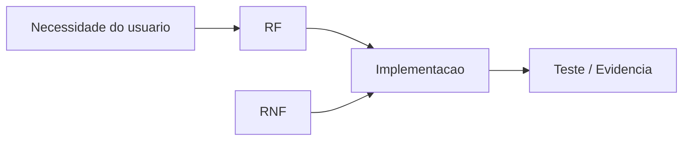

# RTM - Requirements Traceability Matrix

A RTM, ou Matriz de Rastreabilidade de Requisitos, conecta requisitos, regras de negocio, implementacao, testes e evidencias.

Ela ajuda a responder uma pergunta simples:

> Cada requisito importante foi implementado, testado e comprovado?

---

## 1. Para que serve

A RTM serve para:

- garantir que nenhum requisito foi esquecido;
- mostrar onde cada requisito aparece no codigo;
- relacionar requisitos a testes e evidencias;
- apoiar revisao do WAD;
- facilitar manutencao do projeto;
- justificar decisoes de implementacao.

---

## 2. O que uma RTM deve conter

Uma matriz simples pode ter:

| Campo | O que significa |
|---|---|
| ID | Codigo do requisito, como `RF01` ou `RNF-SEC-01` |
| Descricao | Resumo do requisito |
| Regra de negocio | Regra relacionada, quando existir |
| Artefato | Arquivo, endpoint, tela, tabela ou diagrama relacionado |
| Teste/Evidencia | Como provar que foi feito |
| Status | `Pendente`, `Em andamento`, `Concluido` ou `Validado` |

---

## 3. Exemplo de RTM

| ID | Descricao | Regra de negocio | Artefato relacionado | Teste/Evidencia | Status |
|---|---|---|---|---|---|
| RF01 | O sistema deve permitir cadastro de dono da banca | E-mail deve ser unico | `POST /donos-banca` | Teste de cadastro com e-mail novo e repetido | Validado |
| RF02 | O sistema deve permitir login | Senha deve conferir com hash salvo | `POST /login` | Teste com credenciais validas e invalidas | Validado |
| RF03 | O sistema deve permitir cadastro de mercadoria | Mercadoria deve pertencer a uma banca existente | `POST /mercadorias` | Teste de criacao com banca valida e invalida | Em andamento |
| RNF-SEC-01 | Dados de entrada devem ser validados antes do banco | Nenhum payload invalido deve chegar ao Repository | Service + Model | Teste com payload invalido retornando `400` | Validado |
| RNF-MAINT-01 | Controller nao deve executar SQL diretamente | SQL fica apenas no Repository | Controllers e Repositories | Revisao de codigo | Concluido |

---

## 4. Relacao RF, RNF e testes

Um requisito funcional diz o que o sistema faz.

Um requisito nao funcional diz como o sistema deve se comportar.

O teste ou evidencia mostra que aquilo foi cumprido.

---

## 5. Exemplo aplicado a um endpoint

### Requisito

`RF03`: O sistema deve permitir que o dono da banca cadastre uma mercadoria.

### RNFs associados

- `RNF-SEC-01`: todos os dados do `req.body` devem ser validados antes de chegar ao Repository.
- `RNF-SEC-02`: toda query SQL deve usar parametros posicionais.
- `RNF-USA-01`: mensagens de erro devem ser exibidas em portugues.

### Rastreabilidade

| Item | Valor |
|---|---|
| Endpoint | `POST /mercadorias` |
| Controller | `MercadoriaController.create` |
| Service | `MercadoriaService.create` |
| Repository | `MercadoriaRepository.create` |
| Model | `MercadoriaModel.schema` |
| Testes | payload valido, payload invalido, banca inexistente |
| Evidencia | print do teste, log, PR ou resultado do Jest |

---

## 6. Como preencher no projeto

Passo a passo:

1. Liste todos os RFs.
2. Liste os RNFs ligados a cada RF.
3. Identifique quais arquivos implementam cada requisito.
4. Relacione endpoints, tabelas e diagramas.
5. Adicione testes ou evidencias.
6. Atualize o status conforme o projeto evolui.

---

## 7. Template para copiar

| ID | Descricao | Regra de negocio | Artefato relacionado | Teste/Evidencia | Status |
|---|---|---|---|---|---|
| RFXX |  |  |  |  | Pendente |
| RNF-XXX-XX |  |  |  |  | Pendente |

---

## 8. Checklist da RTM

- [ ] Todo RF aparece na matriz.
- [ ] Todo RNF importante aparece na matriz.
- [ ] Cada requisito aponta para pelo menos um artefato.
- [ ] Cada requisito possui teste ou evidencia.
- [ ] O status esta atualizado.
- [ ] A matriz conversa com os diagramas e endpoints do WAD.

