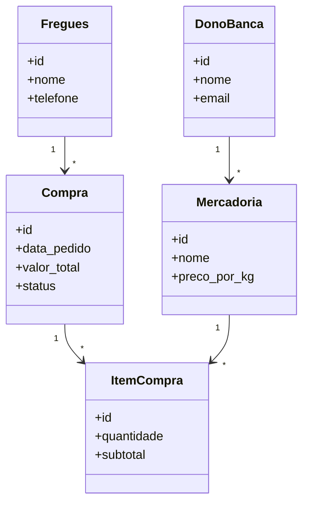
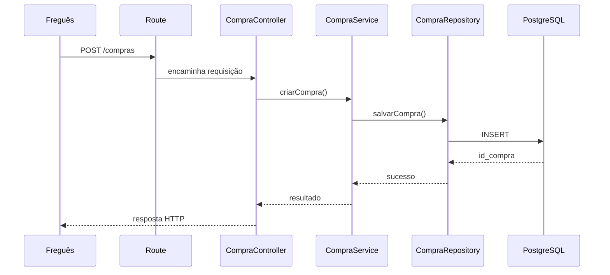
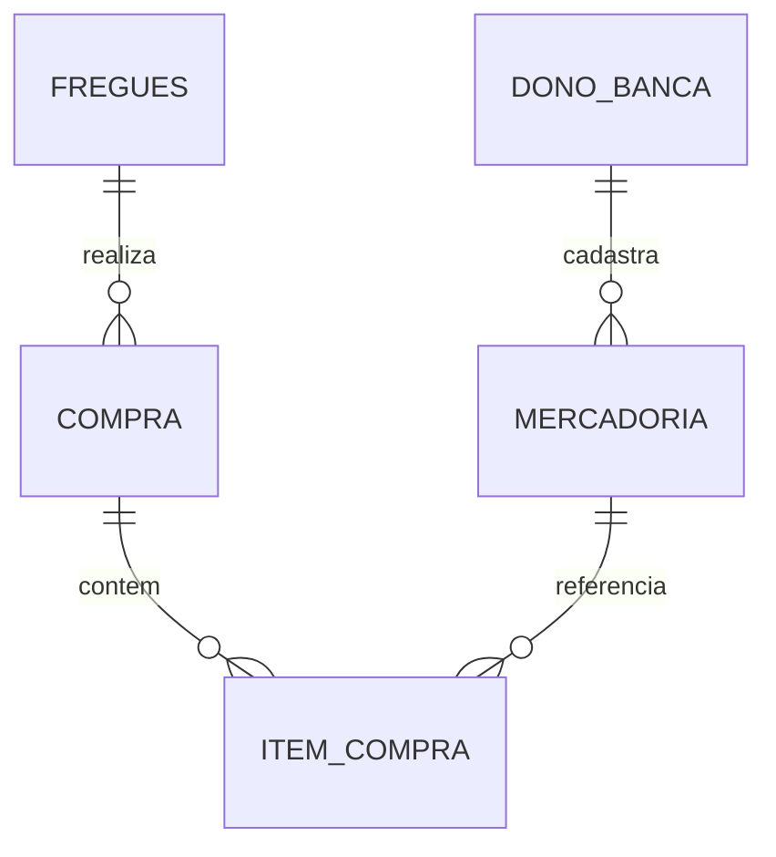

# Modelagens de Software — Kombinado

## Introdução

No desenvolvimento de software, diferentes tipos de modelagem são usados para representar aspectos distintos de um sistema. Cada modelagem responde a perguntas diferentes.

Algumas ajudam a entender **como o sistema é estruturado**, outras mostram **como ele se comporta ao longo do tempo**, e outras representam **como os dados são organizados e armazenados**.

Neste documento serão abordados cinco artefatos centrais:

* **Diagrama de Sequência**
* **Diagrama de Classes**
* **Modelo Relacional**
* **Diagrama de Entidade e Relacionamento (DER)**
* **Modelo de Entidade-Relacionamento (MER)**

Todos serão explicados usando como referência o domínio do projeto **Kombinado**, uma aplicação de gestão de pedidos de feira, em que fregueses realizam compras de mercadorias cadastradas por donos de banca.

---

## O que é cada modelagem

### Diagrama de Sequência

É uma representação comportamental.

Mostra **como os participantes interagem durante a execução de um processo**, em ordem temporal.

Seu foco está em responder:

**“o que acontece primeiro, depois e por quem?”**

---

### Diagrama de Classes

É uma representação estrutural.

Mostra **quais objetos compõem o sistema**, seus atributos e seus relacionamentos.

Seu foco está em responder:

**“quais elementos existem no sistema e como se relacionam?”**

---

### Modelo Relacional

É a representação lógica do banco de dados.

Mostra **como as tabelas serão organizadas**, incluindo atributos, chaves primárias e chaves estrangeiras.

Seu foco está em responder:

**“como os dados serão armazenados?”**

---

### Diagrama de Entidade e Relacionamento (DER)

É a representação gráfica das entidades e de seus relacionamentos.

É uma forma visual de comunicar o modelo de dados.

Seu foco está em responder:

**“quais entidades existem e como se conectam?”**

---

### Modelo de Entidade-Relacionamento (MER)

É a modelagem conceitual do domínio de dados.

Nele ainda não se pensa em tabelas nem em implementação técnica.

Seu foco está em responder:

**“quais conceitos do negócio precisam ser representados?”**

---

# Tabela comparativa

| Artefato              | Contém                                                            | Não contém                                             |
| --------------------- | ----------------------------------------------------------------- | ------------------------------------------------------ |
| Diagrama de Sequência | participantes, mensagens, ordem temporal, fluxo de execução       | estrutura de tabelas, tipos de dados, modelagem física |
| Diagrama de Classes   | classes, atributos, relacionamentos, cardinalidade                | ordem de execução, chamadas temporais                  |
| Modelo Relacional     | tabelas, colunas, PK, FK, estrutura lógica de persistência        | fluxo temporal, interação entre objetos                |
| DER                   | entidades, relacionamentos, cardinalidades                        | detalhes de execução da aplicação                      |
| MER                   | conceitos de negócio, entidades conceituais, relações conceituais | implementação física, SQL, detalhes técnicos de banco  |

---

# 1. Diagrama de Classes

## Para que serve

O diagrama de classes representa a estrutura estática da aplicação.

Ele ajuda a organizar responsabilidades, identificar entidades centrais e orientar a implementação orientada a objetos.

---

## Exemplo — Kombinado

---

## Como fazer

### Passo 1

Identificar entidades do domínio.

No Kombinado:

* dono da banca
* freguês
* mercadoria
* compra
* item de compra

### Passo 2

Definir atributos relevantes.

### Passo 3

Definir relações entre entidades.

---

## Como ler

A leitura é feita observando:

* os blocos → representam classes
* os campos → representam atributos
* as ligações → representam relacionamentos
* as cardinalidades → indicam quantidades possíveis

Exemplo:

**Fregues 1 → * Compra**

Um freguês pode realizar várias compras.

---

# 2. Diagrama de Sequência

## Para que serve

O diagrama de sequência representa o comportamento do sistema ao longo do tempo.

Ele mostra quem participa de um fluxo e em qual ordem as interações acontecem.

---

## Exemplo — Kombinado

---

## Como fazer

### Passo 1

Escolher um fluxo relevante.

Exemplo:

realização de pedido.

### Passo 2

Identificar participantes.

### Passo 3

Ordenar as mensagens em sequência temporal.

---

## Como ler

A leitura acontece de cima para baixo.

Cada seta representa uma mensagem.

Leitura do fluxo:

1. o freguês envia a requisição
2. a rota recebe
3. o controller interpreta
4. o service processa
5. o repository persiste
6. o banco retorna resultado
7. a resposta volta ao usuário

---

# 3. Modelo de Entidade-Relacionamento (MER)

## Para que serve

O MER é uma visão conceitual.

Ele representa o domínio do negócio antes de pensar em tabelas ou SQL.

---

## Exemplo — Kombinado

### Entidades

* DonoBanca
* Fregues
* Mercadoria
* Compra
* ItemCompra

### Relações conceituais

* freguês realiza compra
* compra contém item
* item referencia mercadoria
* dono da banca cadastra mercadoria

---

## Como fazer

### Passo 1

Identificar conceitos centrais do negócio.

### Passo 2

Identificar relações entre esses conceitos.

### Passo 3

Definir cardinalidades conceituais.

---

## Como ler

No MER, a leitura é sem preocupação com implementação.

Exemplo:

> um freguês realiza compras compostas por itens que referenciam mercadorias.

---

# 4. Diagrama de Entidade e Relacionamento (DER)

## Para que serve

O DER transforma o MER em representação visual.

Ele facilita comunicação e validação do modelo de dados.

---

## Exemplo — Kombinado

---

## Como fazer

### Passo 1

Listar entidades.

### Passo 2

Desenhar relações.

### Passo 3

Definir cardinalidades.

---

## Como ler

Exemplo:

**COMPRA ||--o{ ITEM_COMPRA**

Uma compra contém vários itens.

A leitura segue observando entidades e multiplicidades.

---

# 5. Modelo Relacional

## Para que serve

O modelo relacional representa a estrutura lógica de persistência no banco.

Ele traduz o MER e o DER em tabelas.

---

## Exemplo — Kombinado

| Tabela      | Campos principais                                  |
| ----------- | -------------------------------------------------- |
| fregues     | id, nome, telefone                                 |
| mercadoria  | id, nome, preco_por_kg                             |
| compra      | id, fregues_id, data_pedido, valor_total           |
| item_compra | id, compra_id, mercadoria_id, quantidade, subtotal |

---

## Como fazer

### Passo 1

Transformar entidades em tabelas.

### Passo 2

Transformar atributos em colunas.

### Passo 3

Definir chave primária.

### Passo 4

Definir chaves estrangeiras.

---

## Como ler

A leitura segue dependências entre tabelas.

Exemplo:

* `compra.fregues_id` aponta para fregues
* `item_compra.compra_id` aponta para compra
* `item_compra.mercadoria_id` aponta para mercadoria

Isso permite reconstruir todo o pedido no banco.

---

# Leitura integrada de um fluxo completo

Um fluxo completo pode ser interpretado usando as cinco modelagens em conjunto.

## Estrutura

No diagrama de classes, identifica-se:

* freguês
* compra
* item
* mercadoria

## Execução

No diagrama de sequência, observa-se:

* requisição
* processamento
* persistência
* resposta

## Conceito de negócio

No MER, entende-se:

* quem compra
* o que compra
* como isso se relaciona

## Estrutura visual de dados

No DER, visualizam-se as relações.

## Persistência

No modelo relacional, entende-se onde os dados ficam armazenados.

---

# Referências e links de estudo

## Documentação e leitura

* Mermaid — [https://mermaid.js.org/](https://mermaid.js.org/)
* UML Diagrams — [https://www.uml-diagrams.org/](https://www.uml-diagrams.org/)
* Lucidchart — [https://www.lucidchart.com/pages/uml-diagram](https://www.lucidchart.com/pages/uml-diagram)
* IBM — Data Modeling — [https://www.ibm.com/topics/data-modeling](https://www.ibm.com/topics/data-modeling)
* Oracle — Database Design — [https://docs.oracle.com/](https://docs.oracle.com/)

---

## Vídeos

### UML — Diagrama de Classes

* [https://www.youtube.com/watch?v=UI6lqHOVHic](https://www.youtube.com/watch?v=UI6lqHOVHic)
* [https://www.youtube.com/watch?v=6XrL5jXmTwM](https://www.youtube.com/watch?v=6XrL5jXmTwM)

### UML — Diagrama de Sequência

* [https://www.youtube.com/watch?v=pCK6prSq8aw](https://www.youtube.com/watch?v=pCK6prSq8aw)
* [https://www.youtube.com/watch?v=WnMQ8HlmeXc](https://www.youtube.com/watch?v=WnMQ8HlmeXc)

### Modelagem de Dados / DER / MER

* [https://www.youtube.com/watch?v=Yl9wcR4k6Ws](https://www.youtube.com/watch?v=Yl9wcR4k6Ws)
* [https://www.youtube.com/watch?v=5m1pR4uYj8A](https://www.youtube.com/watch?v=5m1pR4uYj8A)

---

## Material complementar

### Livro

Martin Fowler — *UML Distilled*

### Banco de dados

Carlos Alberto Heuser — *Projeto de Banco de Dados*
