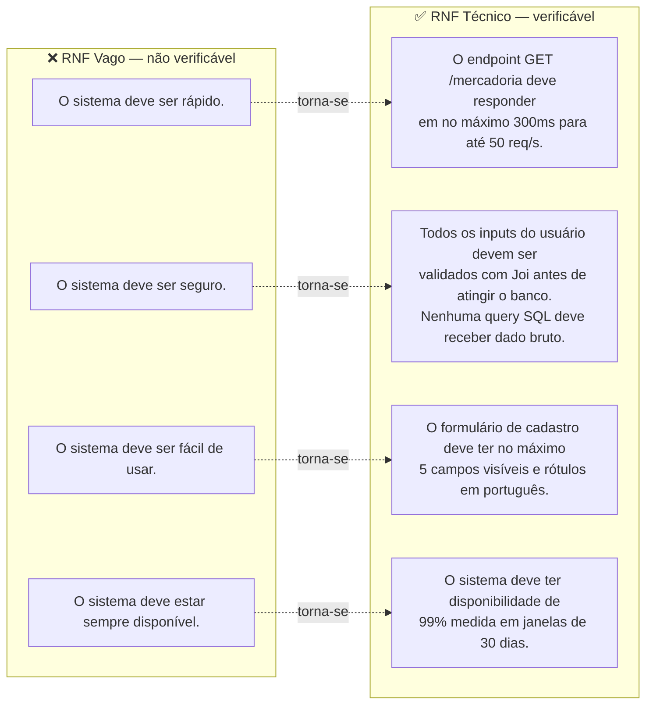
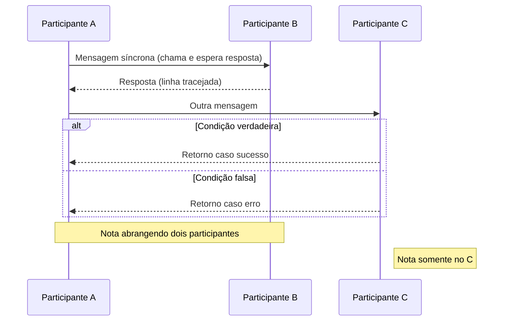
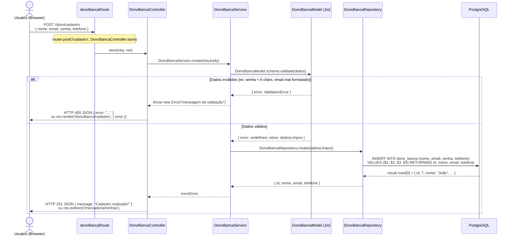
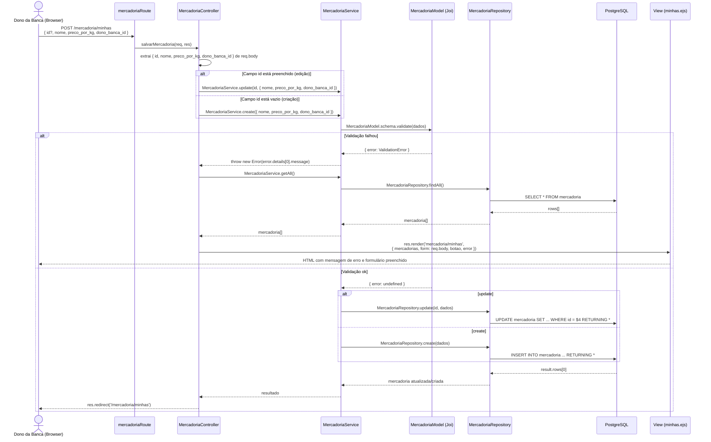
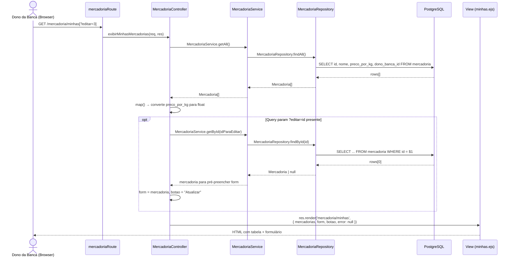
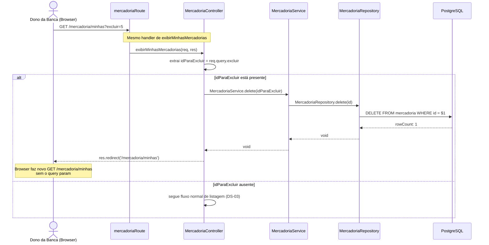
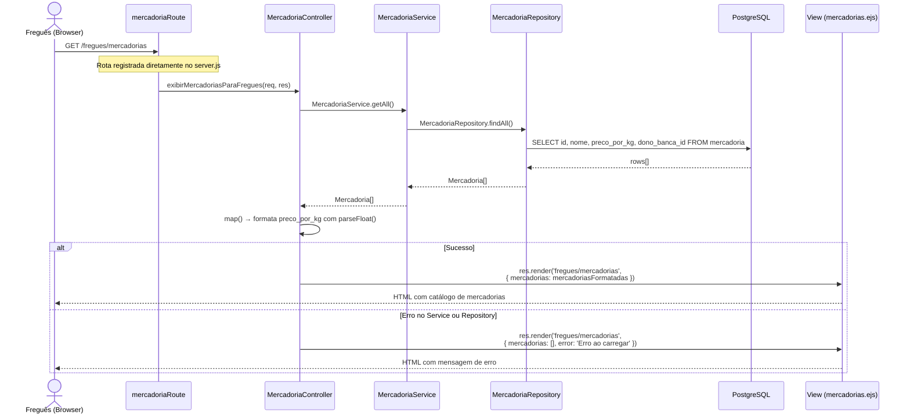
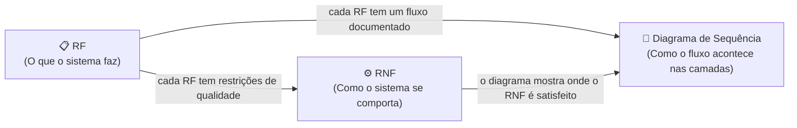
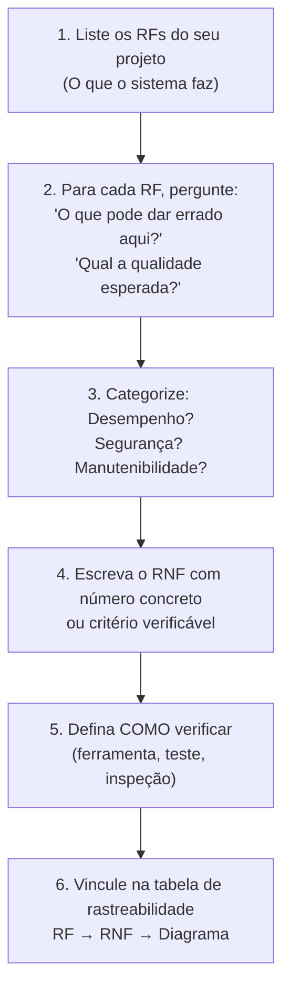

# Guia de Design Computacional
## Requisitos Não-Funcionais, Diagramas de Sequência UML e Rastreabilidade

> **Para quem é este guia:** Alunos que estão desenvolvendo um sistema web em TypeScript com arquitetura MVC estendida (Routes → Controller → Service → Repository → Model → DB).
>
> **O que você vai aprender:**
> 1. Como identificar Requisitos Funcionais (RFs) do seu projeto
> 2. Como escrever Requisitos Não-Funcionais (RNFs) de forma **técnica e verificável**
> 3. Como desenhar Diagramas de Sequência UML entre as camadas do backend
> 4. Como montar uma **Tabela de Rastreabilidade** conectando RF → RNF → Diagrama
> 5. Onde encontrar vídeos de apoio para revisar os conceitos
>
> ⚠️ **Este guia é um material de apoio.** Ele não substitui as aulas nem o autoestudo aprofundado. O professor é o principal responsável pelo seu aprendizado e quem define o que está correto no contexto da disciplina.

---

## Parte 1 — Requisitos Funcionais (RFs)

### O que é um RF?

Um Requisito Funcional descreve **o que o sistema deve fazer** — uma ação, comportamento ou função que o usuário pode executar.

**Formato recomendado:**
```
RF[número]: O sistema deve permitir que [ator] [faça algo] [em qual contexto].
```

### Exemplos baseados no projeto da Banca da Feira

| ID | Descrição |
|---|---|
| **RF01** | O sistema deve permitir que o Dono da Banca se cadastre informando nome, e-mail, senha e telefone. |
| **RF02** | O sistema deve permitir que o Dono da Banca faça login com e-mail e senha. |
| **RF03** | O sistema deve permitir que o Dono da Banca cadastre uma mercadoria com nome, preço por kg e vínculo com sua banca. |
| **RF04** | O sistema deve permitir que o Dono da Banca liste todas as suas mercadorias cadastradas. |
| **RF05** | O sistema deve permitir que o Dono da Banca edite os dados de uma mercadoria existente. |
| **RF06** | O sistema deve permitir que o Dono da Banca exclua uma mercadoria da sua lista. |
| **RF07** | O sistema deve permitir que o Freguês visualize o catálogo de mercadorias disponíveis. |
| **RF08** | O sistema deve permitir que o Dono da Banca registre uma nova compra vinculada a um Freguês. |
| **RF09** | O sistema deve permitir que o Dono da Banca visualize o histórico de compras. |

---

## Parte 2 — Requisitos Não-Funcionais (RNFs)

### 2.1 O que é um RNF?

Um Requisito Não-Funcional descreve **como o sistema deve se comportar** — qualidade, desempenho, segurança, manutenibilidade. Ele não descreve uma funcionalidade, mas **uma restrição ou propriedade** sobre o sistema.

### 2.2 O problema dos RNFs vagos

Muitos estudantes (e até profissionais) escrevem RNFs que **não podem ser testados**. Veja a diferença:



### 2.3 Critério SMART para RNFs

Um bom RNF deve ser:

| Letra | Critério | Pergunta a fazer |
|---|---|---|
| **S** | Específico | *"Para qual parte do sistema isso se aplica?"* |
| **M** | Mensurável | *"Como eu provo que está sendo cumprido? Qual o número?"* |
| **A** | Atingível | *"É tecnicamente possível com o stack do projeto?"* |
| **R** | Relevante | *"Impacta o usuário ou a manutenção do sistema?"* |
| **T** | Verificável | *"Existe um teste, métrica ou ferramenta que confirme?"* |

### 2.4 Categorias de RNFs e exemplos para o projeto

---

#### 🚀 Desempenho (Performance)

> Trata do tempo de resposta e capacidade de processamento do sistema.

**RNF-PERF-01**
```
O endpoint GET /mercadoria/minhas deve retornar resposta HTTP 200
com o HTML renderizado em no máximo 500ms, medido do recebimento
da requisição até o envio da resposta, em condições normais de uso
(banco local, até 100 registros).

Verificação: teste com Artillery ou k6 simulando 10 usuários
simultâneos durante 30 segundos.
```

**RNF-PERF-02**
```
O endpoint POST /mercadoria/minhas deve processar a inserção e
redirecionar (HTTP 302) em no máximo 400ms para payloads com
até 3 campos de texto.

Verificação: log de tempo no middleware do Express ou ferramenta
Postman com cronômetro de resposta.
```

---

#### 🔐 Segurança (Security)

> Trata de proteção de dados e prevenção de ataques.

**RNF-SEC-01**
```
100% dos dados submetidos via req.body devem passar pela validação
do schema Joi na camada Service antes de qualquer interação com
a camada Repository.

Verificação: revisão de código (code review) garantindo que nenhum
método do Repository seja chamado sem validação prévia no Service
correspondente. Teste com payload inválido deve retornar HTTP 400
sem executar query SQL.
```

**RNF-SEC-02**
```
Todas as queries SQL devem usar parâmetros posicionais ($1, $2, ...)
via pg.Pool.query(text, params). É proibido concatenar strings com
dados do usuário para construir SQL.

Verificação: grep/busca no código-fonte por padrões de concatenação
como `'... WHERE id = ' + id`. Qualquer ocorrência é uma violação.
```

**RNF-SEC-03**
```
Senhas não devem ser armazenadas em texto plano no banco de dados.
Deve ser aplicado hash com bcrypt usando custo (saltRounds) mínimo
de 10 antes do INSERT.

Verificação: inspecionar o valor da coluna senha no banco após
cadastro — o valor deve começar com $2b$ (hash bcrypt).
```

---

#### 🏗️ Manutenibilidade (Maintainability)

> Trata de como o código é organizado e o quão fácil é modificá-lo.

**RNF-MAINT-01**
```
A arquitetura deve seguir separação estrita de responsabilidades
em 5 camadas: Route, Controller, Service, Repository e Model.
Nenhum arquivo da camada Controller deve importar diretamente
db.ts ou executar queries SQL.

Verificação: análise estática do código verificando que nenhum
arquivo em controllers/ contém import de config/db ou chamadas
a pool.query().
```

**RNF-MAINT-02**
```
Cada entidade do domínio (Mercadoria, Compra, Fregues, DonoBanca)
deve possuir exatamente um arquivo em cada camada (model, repository,
service, controller, route). Não deve haver lógica de negócio
duplicada entre arquivos de Service diferentes.

Verificação: contagem de arquivos por pasta e revisão manual
de métodos duplicados.
```

---

#### 📶 Disponibilidade (Availability)

> Trata de quanto tempo o sistema está operacional.

**RNF-AVAIL-01**
```
A aplicação deve tratar falhas de conexão com o banco de dados:
se db.connect() falhar na inicialização, o processo Node.js deve
encerrar com código de saída não-zero (process.exit(1)) e logar
a mensagem de erro no stderr.

Verificação: derrubar o PostgreSQL e iniciar o servidor —
o processo deve encerrar em no máximo 5 segundos com mensagem
de erro visível no terminal.
```

**RNF-AVAIL-02**
```
Rotas não encontradas devem retornar HTTP 404 com mensagem
informativa. Erros internos do servidor devem retornar HTTP 500
sem expor stack trace ao cliente (apenas logar internamente).

Verificação: requisição para /rota-inexistente deve retornar
status 404. Erro forçado no Service deve retornar 500 sem
mostrar o stack trace no body da resposta.
```

---

#### 🎨 Usabilidade (Usability)

> Trata da experiência do usuário final com a interface.

**RNF-USA-01**
```
Mensagens de erro de validação exibidas na View devem ser
em português e conter no máximo 80 caracteres. Devem aparecer
na mesma página do formulário, sem redirecionar o usuário,
preservando os dados já preenchidos no formulário.

Verificação: submeter formulário com dado inválido e verificar
que: (a) página não redireciona, (b) mensagem aparece em vermelho,
(c) campos já preenchidos mantêm seus valores.
```

---

#### ⚙️ Compatibilidade / Portabilidade

> Trata de em quais ambientes o sistema funciona.

**RNF-PORT-01**
```
A aplicação deve funcionar em Node.js versão 18.x ou superior.
Todas as dependências devem estar listadas em package.json com
versões fixas (sem ^ ou ~), garantindo instalação idempotente
via npm ci.

Verificação: clonar o repositório em máquina limpa, executar
npm ci e npm start — a aplicação deve iniciar sem erros.
```

---

## Parte 3 — Diagramas de Sequência UML

### 3.1 O que é um Diagrama de Sequência UML?

O Diagrama de Sequência UML mostra **a ordem das interações** entre os participantes (atores, camadas, sistemas) ao longo do tempo. O tempo flui de **cima para baixo**.

### Elementos fundamentais:



| Símbolo | Significado |
|---|---|
| `A->>B: msg` | Chamada síncrona (A chama B e aguarda) |
| `B-->>A: msg` | Retorno (linha tracejada) |
| `alt / else / end` | Bloco condicional (if/else) |
| `loop` | Laço de repetição |
| `opt` | Bloco opcional |
| `Note` | Anotação explicativa |

---

### 3.2 Diagrama DS-01 — Cadastro de Dono da Banca

> Cobre o RF01. Mostra o fluxo completo desde o submit do formulário até a resposta ao browser.



---

### 3.3 Diagrama DS-02 — Cadastro de Mercadoria (via formulário HTML)

> Cobre o RF03. Destaca o duplo caminho: criar novo vs. atualizar existente.



---

### 3.4 Diagrama DS-03 — Listagem de Mercadorias para o Dono (GET com render)

> Cobre o RF04. Mostra o fluxo de leitura com suporte a query params para edição inline.



---

### 3.5 Diagrama DS-04 — Exclusão de Mercadoria (via query param)

> Cobre o RF06. Mostra um padrão diferente: exclusão acionada por query param GET (não por DELETE HTTP).



---

### 3.6 Diagrama DS-05 — Visualização de Mercadorias pelo Freguês

> Cobre o RF07. Rota pública, sem autenticação, apenas leitura.



---

## Parte 4 — Tabela de Rastreabilidade RF → RNF → Diagrama

> A rastreabilidade garante que cada funcionalidade tem qualidade documentada e cada diagrama tem origem num requisito funcional.



### Tabela Principal

| RF | Descrição Resumida | RNFs Relacionados | Diagrama(s) | Camada onde o RNF é verificado |
|---|---|---|---|---|
| **RF01** | Cadastro de Dono da Banca | RNF-SEC-01, RNF-SEC-02, RNF-SEC-03, RNF-AVAIL-02 | DS-01 | Service (validação Joi), Repository (query parametrizada), Repository (hash bcrypt) |
| **RF02** | Login de Dono da Banca | RNF-SEC-01, RNF-SEC-02, RNF-PERF-01 | — | Service (validação), Repository (SELECT seguro) |
| **RF03** | Cadastro de Mercadoria | RNF-SEC-01, RNF-SEC-02, RNF-MAINT-01, RNF-USA-01 | DS-02 | Service (Joi), Repository (params), Controller (render com erro) |
| **RF04** | Listar Mercadorias (Dono) | RNF-PERF-01, RNF-MAINT-01 | DS-03 | Repository (SELECT), Controller (formatação) |
| **RF05** | Editar Mercadoria | RNF-SEC-01, RNF-SEC-02, RNF-USA-01 | DS-02, DS-03 | Service (Joi), Repository (UPDATE params) |
| **RF06** | Excluir Mercadoria | RNF-AVAIL-02, RNF-MAINT-01 | DS-04 | Controller (query param), Service (delete) |
| **RF07** | Catálogo para Freguês | RNF-PERF-01, RNF-AVAIL-02 | DS-05 | Repository (SELECT), Controller (try/catch) |
| **RF08** | Registrar Compra | RNF-SEC-01, RNF-SEC-02, RNF-MAINT-02 | — | Service (CompraModel.schema), Repository (INSERT params) |
| **RF09** | Histórico de Compras | RNF-PERF-01, RNF-MAINT-01 | — | Repository (SELECT com JOIN) |

---

### Tabela Detalhada de RNFs

| ID | Categoria | Enunciado Técnico Resumido | Como Verificar | RFs Cobertos |
|---|---|---|---|---|
| **RNF-PERF-01** | Desempenho | GET /mercadoria responde em ≤ 500ms (100 registros, uso normal) | k6 / Artillery com 10 usuários simultâneos | RF02, RF04, RF07, RF09 |
| **RNF-PERF-02** | Desempenho | POST de inserção responde em ≤ 400ms | Postman cronômetro / middleware de log | RF01, RF03, RF08 |
| **RNF-SEC-01** | Segurança | 100% dos req.body validados por Joi no Service antes do Repository | Code review: nenhum Repository chamado sem validação prévia | RF01, RF02, RF03, RF05, RF08 |
| **RNF-SEC-02** | Segurança | SQL usa exclusivamente parâmetros posicionais ($1, $2, ...) | grep no código por concatenação de strings SQL | RF01–RF09 |
| **RNF-SEC-03** | Segurança | Senhas armazenadas com bcrypt (saltRounds ≥ 10) | Inspecionar coluna senha no banco; deve iniciar com $2b$ | RF01 |
| **RNF-MAINT-01** | Manutenibilidade | Controllers não importam config/db nem executam SQL direto | Análise estática: nenhum import de db em controllers/ | RF03, RF04, RF06, RF07 |
| **RNF-MAINT-02** | Manutenibilidade | Uma entidade = um arquivo por camada; sem lógica duplicada entre Services | Revisão manual de Services; contagem de arquivos por pasta | RF08 |
| **RNF-AVAIL-01** | Disponibilidade | Falha de conexão com DB encerra processo com process.exit(1) e log no stderr | Derrubar PostgreSQL e iniciar servidor | RF01–RF09 |
| **RNF-AVAIL-02** | Disponibilidade | 404 retorna status 404; 500 retorna status 500 sem expor stack trace | Requisição para rota inválida; erro forçado no Service | RF01, RF06, RF07 |
| **RNF-USA-01** | Usabilidade | Erros de validação em português, ≤ 80 chars, na mesma página, campos preservados | Teste manual com dado inválido no formulário | RF01, RF03, RF05 |
| **RNF-PORT-01** | Portabilidade | Funciona em Node.js ≥ 18.x; package.json com versões fixas; npm ci sem erros | Clone + npm ci + npm start em máquina limpa | RF01–RF09 |

---

### Matriz de Cobertura por Camada

> Esta tabela mostra **onde, na arquitetura**, cada categoria de RNF é implementada e verificável.

| Categoria RNF | Route | Controller | Service | Repository | Model | Config/DB | View |
|---|:---:|:---:|:---:|:---:|:---:|:---:|:---:|
| **Desempenho** | | ✓ | ✓ | ✓ | | ✓ | |
| **Segurança (validação)** | | | ✓ | | ✓ | | |
| **Segurança (SQL)** | | | | ✓ | | | |
| **Segurança (senha)** | | | ✓ | ✓ | | | |
| **Manutenibilidade** | ✓ | ✓ | ✓ | ✓ | ✓ | | |
| **Disponibilidade** | | ✓ | ✓ | | | ✓ | |
| **Usabilidade** | | ✓ | | | | | ✓ |
| **Portabilidade** | | | | | | ✓ | |

---

## Parte 5 — Como aplicar ao SEU projeto

### Passo a passo para escrever seus próprios RNFs:



### Template de RNF para preencher:

```
[ID]-[CATEGORIA]-[NÚMERO]
Contexto: [Qual parte do sistema / qual endpoint / qual camada]
Requisito: [O sistema deve / não deve + critério mensurável]
Verificação: [Como provar que está cumprido — ferramenta, teste, inspeção de código]
RF(s) cobertos: [RF01, RF03, ...]
```

**Exemplo preenchido:**
```
RNF-SEC-01
Contexto: Camada Service — métodos create() e update() de todas as entidades
Requisito: 100% dos dados de req.body devem ser validados pelo schema Joi
           da entidade correspondente antes de qualquer chamada ao Repository.
           Payload inválido deve lançar erro sem executar SQL.
Verificação: (a) Code review garantindo chamada a schema.validate() antes de
             Repository em todos os Services.
             (b) Teste de integração: POST com campo obrigatório ausente →
             deve retornar HTTP 400 sem criar registro no banco.
RFs cobertos: RF01, RF03, RF05, RF08
```

---

### Checklist antes de entregar seu documento de design:

- [ ] Cada RF tem pelo menos um RNF associado
- [ ] Cada RNF tem um critério mensurável (número, porcentagem, ferramenta)
- [ ] Cada RNF tem um método de verificação definido
- [ ] Os 5 principais fluxos do seu sistema têm diagrama de sequência
- [ ] Os diagramas mostram todas as camadas: Route → Controller → Service → Repository → DB
- [ ] Os diagramas incluem blocos `alt/else` para caminhos de erro
- [ ] A tabela de rastreabilidade cobre todos os RFs e RNFs
- [ ] A matriz de cobertura por camada está preenchida

---

## Parte 6 — Vídeos de Apoio

> ⚠️ **Aviso importante antes de assistir**
>
> Estes vídeos são um **complemento pontual** — úteis para ver um conceito explicado de outro ângulo ou revisar algo que ficou com dúvida. Eles **não substituem** as aulas, os materiais indicados pelo professor nem o seu autoestudo aprofundado.
>
> **O professor é o principal responsável pelo seu aprendizado** e é ele quem define o que está correto ou incorreto no contexto da disciplina. Em caso de dúvida entre o que um vídeo apresenta e o que foi visto em aula, **prevalesce sempre a orientação do professor.**

---

### 🎬 Vídeo 1 — MVC explicado em poucos minutos

**Canal:** Código Fonte TV
**Título:** MVC // Dicionário do Programador
**Link:** [https://www.youtube.com/watch?v=jyTNhT67ZyY](https://www.youtube.com/watch?v=jyTNhT67ZyY)

**Por que assistir:** Introdução visual e direta ao padrão MVC — Model, View e Controller — com linguagem acessível. Bom ponto de partida para entender a separação de responsabilidades antes de mergulhar na arquitetura estendida do projeto.

**Conecta com este guia:** Partes 1 e 3 (entendimento da camada Controller nos diagramas de sequência).

---

### 🎬 Vídeo 2 — Regras de Negócio na programação

**Canal:** Código Fonte TV
**Título:** Regras de Negócio na Programação // Dicionário do Programador
**Link:** [https://www.youtube.com/watch?v=N9w5-TChccQ](https://www.youtube.com/watch?v=N9w5-TChccQ)

**Por que assistir:** Explica o conceito de regra de negócio — que no projeto vive na camada **Service** — e por que identificá-las e separá-las do resto do código é fundamental para uma arquitetura limpa e manutenível.

**Conecta com este guia:** Parte 2 (RNF-MAINT-01 e RNF-SEC-01) e Parte 3 (por que o Service valida antes de chamar o Repository).

---

### 🎬 Vídeo 3 — Requisitos, Regras de Negócio, User Stories e Critérios de Aceitação

**Canal:** pessonizando
**Título:** Requisitos, Regra de negócio, User Stories, Critério de aceitação, Cenário e Caso de teste: Entenda
**Link:** [https://www.youtube.com/watch?v=5r4xDXNna_E](https://www.youtube.com/watch?v=5r4xDXNna_E)

**Por que assistir:** Desmonta de forma didática a confusão comum entre requisito funcional, requisito não-funcional, regra de negócio e critério de aceitação — todos conceitos que aparecem na Tabela de Rastreabilidade deste guia. O vídeo tem capítulos marcados na descrição, então você pode pular direto para o trecho que precisa.

**Conecta com este guia:** Partes 1, 2 e 5 (critério SMART e métodos de verificação dos RNFs).

---

*Guia elaborado com base na arquitetura MVC estendida do projeto Banca da Feira (Node.js + TypeScript + Express + PostgreSQL + EJS)*